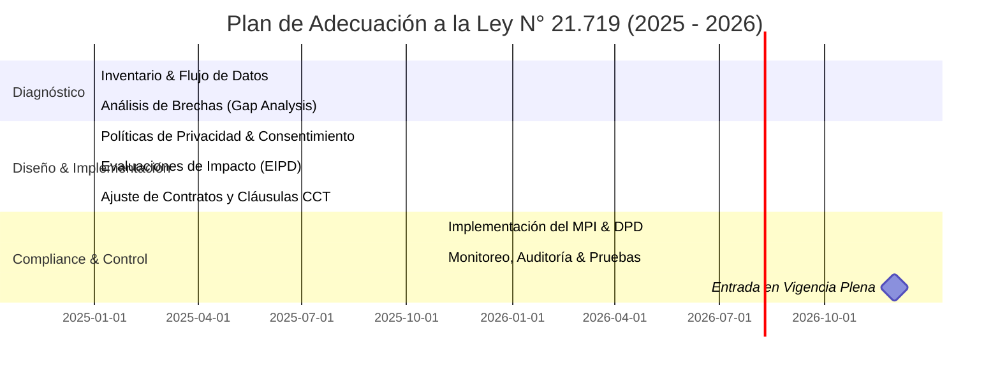

# Ley N° 21.719: Regulación del Tratamiento y Protección de Datos Personales en Chile

> **Nota de Vigencia:** Publicada en el Diario Oficial el **13 de diciembre de 2024**, esta histórica normativa entrará en plena vigencia el **1 de diciembre de 2026**. Su objetivo principal es modernizar la antigua Ley N° 19.628 (vigente desde 1999) y elevar los estándares locales al nivel del Reglamento General de Protección de Datos (RGPD) de la Unión Europea.

---

## 🗺️ Mapa de Relaciones del Ecosistema de Datos

El siguiente diagrama ilustra cómo interactúan los actores clave del nuevo ecosistema de protección de datos personales bajo la **Ley N° 21.719**:

```mermaid
graph TD
    %% Definición de Nodos
    T[Titular de los Datos <br><b>(Ciudadano/Usuario)</b>]
    R[Responsable del Tratamiento <br><b>(Empresa, Institución Pública)</b>]
    DPD[Delegado de Protección de Datos <br><b>(DPO / DPD)</b>]
    APDP[Agencia de Protección de Datos <br><b>(APDP - Autoridad de Control)</b>]

    %% Flujos y Relaciones
    T -- 1. Ejerce derechos ARCO-P y entrega consentimiento --> R
    R -- 2. Nombra, dota de recursos y otorga independencia --> DPD
    DPD -- 3. Asesora y supervisa cumplimiento interno --> R
    T -- 4. Interpone reclamos y denuncias --> APDP
    APDP -- 5. Fiscaliza, sanciona y dicta directrices --> R
    DPD -- 6. Actúa como canal de enlace e interlocutor --> APDP

    %% Estilos de Diseño
    style T fill:#f9f9f9,stroke:#333,stroke-width:2px;
    style R fill:#e1f5fe,stroke:#0288d1,stroke-width:2px;
    style DPD fill:#efebe9,stroke:#5d4037,stroke-width:2px;
    style APDP fill:#ffebee,stroke:#c62828,stroke-width:2px;
```

---

## 🏛️ Los 7 Principios Fundamentales del Tratamiento de Datos

Todo tratamiento de datos personales en Chile debe regirse por los principios consagrados en el **Artículo 3°** de la ley:

1. **Licitud y Lealtad:** Los datos deben tratarse con apego a la ley y de manera justa, sin engaños, manipulación ni fines abusivos. Todo tratamiento requiere una base legal válida.
2. **Finalidad:** Los datos deben ser recolectados para fines específicos, explícitos y legítimos. Queda prohibido su uso posterior para fines incompatibles con los declarados originalmente.
3. **Proporcionalidad (Minimización):** Solo se deben recopilar y tratar los datos que sean estrictamente necesarios, pertinentes y adecuados para la finalidad declarada.
4. **Calidad y Exactitud:** Los datos deben ser exactos, completos y estar actualizados. Deben eliminarse o anonimizarse tan pronto dejen de ser necesarios para el fin con el que se recopilaron.
5. **Responsabilidad Proactiva (Accountability):** El responsable del tratamiento no solo debe cumplir la ley, sino también estar en condiciones de **demostrar y acreditar** dicho cumplimiento ante la autoridad.
6. **Seguridad:** Es obligatorio adoptar medidas técnicas y organizacionales apropiadas para resguardar la confidencialidad, integridad y disponibilidad de los datos, previniendo pérdidas o accesos no autorizados.
7. **Transparencia e Información:** Se debe garantizar al titular información clara, accesible y oportuna sobre quién trata sus datos, para qué fines, y cómo puede ejercer sus derechos.

---

## ⚖️ Bases Legales de Licitud (¿Cuándo es legal tratar datos?)

Para que el tratamiento de datos personales sea lícito, la organización debe contar con **al menos una** de las siguientes condiciones:

* **Consentimiento del Titular:** Debe ser libre, específico, informado e inequívoco (otorgado mediante una declaración o una acción afirmativa clara).
* **Obligación Legal:** Cuando el tratamiento es exigido por una norma legal en el ejercicio de las funciones del responsable.
* **Ejecución de un Contrato:** Cuando el tratamiento es necesario para la ejecución de un contrato o para la aplicación de medidas precontractuales a solicitud del titular.
* **Interés Legítimo:** El tratamiento es lícito si responde a un interés legítimo del responsable o de un tercero, siempre que no prevalezcan sobre este los derechos y libertades fundamentales del titular (requiere un juicio de ponderación documentado).
* **Protección de Intereses Vitales:** Necesario para proteger la vida o la integridad física del titular o de otra persona natural.
* **Misión de Interés Público:** Tratamiento necesario para el cumplimiento de una misión realizada en interés público o en el ejercicio de poderes públicos conferidos al responsable.

---

## 👤 Derechos de los Titulares (ARCO-P)

La ley empodera a las personas naturales otorgándoles herramientas directas para controlar su información personal:

* **Acceso (A):** Derecho a saber si se están tratando sus datos, con qué finalidad, los destinatarios de los mismos y el período de conservación.
* **Rectificación (R):** Solicitar la corrección de datos que sean inexactos, desactualizados, incompletos o erróneos.
* **Cancelación / Supresión (C):** Exigir la eliminación de datos cuando hayan dejado de ser necesarios, el tratamiento sea ilícito, o se haya revocado el consentimiento (equivalente al "Derecho al Olvido").
* **Oposición (O):** Oponerse al tratamiento por motivos fundados y legítimos, o cuando el tratamiento tenga por objeto la mercadotecnia directa.
* **Portabilidad (P):** **(Nueva Incorporación)** Derecho a recibir sus datos personales en un formato estructurado, de uso común y lectura mecánica, y a transmitirlos a otro responsable sin impedimentos.
* **Bloqueo:** Derecho a suspender temporalmente cualquier operación de tratamiento de sus datos durante procesos de verificación o reclamación.

---

## 🛡️ Protección Especial para Datos Sensibles y Menores

### 1. Datos Sensibles
Corresponden a categorías especiales de datos que, por su naturaleza, conllevan un riesgo elevado para los derechos fundamentales (origen racial/étnico, convicciones políticas/religiosas, salud, vida sexual, datos biométricos, genéticos, afiliación sindical y antecedentes penales).
> [!IMPORTANT]
> Su tratamiento está **prohibido por regla general**, salvo consentimiento expreso y por escrito del titular, o por habilitación legal directa. Además, el tratamiento de datos de alto riesgo (como los sensibles) exige la realización previa de una **Evaluación de Impacto en Protección de Datos (EIPD)**.

### 2. Datos de Niños, Niñas y Adolescentes (NNA)
La ley sitúa el **interés superior del menor** y su **autonomía progresiva** en el centro de la regulación:
* **Menores de 14 años (Niños y Niñas):** El consentimiento debe ser otorgado obligatoriamente por sus padres, representantes legales o quienes tengan su cuidado personal.
* **Adolescentes (14 a 17 años):** Pueden prestar consentimiento por sí mismos bajo las reglas generales, **excepto** para el tratamiento de sus datos sensibles antes de los 16 años, donde se requiere la autorización de sus representantes legales.
* **Instituciones Educativas:** Se establece una responsabilidad reforzada de protección para los establecimientos escolares y académicos.

---

## 🏢 La Agencia de Protección de Datos Personales (APDP)

Se crea la **APDP** como una corporación autónoma de derecho público, con personalidad jurídica y patrimonio propio. Sus principales atribuciones son:

* **Fiscalización y Sanción:** Investigar de oficio o por denuncia las infracciones a la ley y aplicar las multas administrativas correspondientes.
* **Normativa:** Dictar directrices, circulares y resoluciones generales para la correcta aplicación e interpretación de la ley.
* **Registro de Sanciones:** Mantener y administrar el **Registro Nacional de Sanciones y Cumplimiento**, el cual será de carácter público.
* **Mediación y Promoción:** Velar por el fomento de una cultura de protección de datos y resolver conflictos entre titulares y responsables de manera extrajudicial.

---

## 🎯 Modelo de Prevención de Infracciones (MPI) y el DPD

El legislador chileno promueve una cultura de cumplimiento mediante incentivos de autorregulación (de forma análoga al compliance penal de la Ley 20.393):

### Modelo de Prevención de Infracciones (MPI)
Es un programa corporativo de cumplimiento voluntario que, una vez implementado y **certificado por la APDP**, funciona como una **circunstancia atenuante muy calificada** ante cualquier procedimiento sancionatorio. 
Para ser válido, un MPI debe contar con:
1. Designación de un **Delegado de Protección de Datos (DPD)**.
2. Definición clara de sus recursos, facultades y autonomía.
3. Matriz de riesgos y mapa de flujo de datos.
4. Protocolos y políticas de control interno.
5. Canales de denuncia interna y procedimientos disciplinarios.

### El Delegado de Protección de Datos (DPD / DPO)
* **¿Cuándo es obligatorio?** Es obligatorio para todas las instituciones públicas, para organizaciones que adopten un MPI certificado, y para entidades cuya actividad principal requiera un control habitual y sistemático a gran escala.
* **Rol:** Es la figura encargada de supervisar de forma independiente la implementación de las políticas de datos dentro de la organización y actúa como puente de comunicación directa con los titulares y la APDP.

---

## 💸 Régimen de Infracciones y Multas

Las multas se calculan en **Unidades Tributarias Mensuales (UTM)** y se dividen en tres categorías principales:

| Gravedad de Infracción | Sanción / Multa Máxima | Cálculo Alternativo (Grandes Empresas) |
| :--- | :--- | :--- |
| **Leve** *(ej. retrasos formales, falta de información mínima)* | Amonestación escrita o hasta **5.000 UTM** | *No aplica alternativo* |
| **Grave** *(ej. tratar datos sin base legal, no notificar brechas)* | Multa de hasta **10.000 UTM** | Hasta el **2% de los ingresos anuales** por ventas y servicios en Chile |
| **Gravísima** *(ej. obstrucción a la APDP, tratar datos sensibles sin consentimiento)* | Multa de hasta **20.000 UTM** | Hasta el **4% de los ingresos anuales** por ventas y servicios en Chile |

> [!WARNING]
> **Reincidencia:** En caso de reincidencia en infracciones gravísimas, la multa máxima puede incrementarse hasta **tres veces (60.000 UTM)** o suspenderse temporalmente las actividades de tratamiento de datos de la organización.

---

## 🌍 Transferencias Internacionales de Datos

La ley prohíbe la transferencia de datos personales a países que no proporcionen un nivel de protección adecuado, similar al chileno. Para que una transferencia transfronteriza sea lícita, debe contar con:

1. **Decisión de Adecuación:** Que el país de destino esté formalmente reconocido por la APDP como seguro.
2. **Garantías Apropiadas:** Uso de **Cláusulas Contractuales Tipo (CCT)** aprobadas por la APDP o **Normas Corporativas Vinculantes (BCR)** para grupos multinacionales.
3. **Excepciones de Ley:** Consentimiento expreso del titular, necesidad para la ejecución contractual, o cooperación judicial internacional.

---

## 🚀 Hoja de Ruta para Organizaciones (Camino a Diciembre 2026)

Las organizaciones públicas y privadas que operan en Chile deben aprovechar el periodo de vacancia legal para adecuarse a la norma mediante los siguientes pasos estratégicos:



1. **Mapear e Inventariar Datos:** Identificar qué datos personales se recopilan, procesan, almacenan y transfieren en la organización.
2. **Auditoría de Bases Legales:** Evaluar si las actividades actuales se fundamentan adecuadamente (consentimiento, contrato, interés legítimo, etc.).
3. **Implementar Medidas de Ciberseguridad:** Fortalecer la seguridad lógica y física de la información personal almacenada para evitar brechas de seguridad (que conllevan multas graves).
4. **Diseñar el MPI:** Formular y estructurar un Modelo de Prevención de Infracciones adaptado a los riesgos específicos de la organización.
5. **Capacitación Interna:** Educar a colaboradores y ejecutivos sobre el valor de la privacidad y los nuevos procedimientos que exige la ley.
