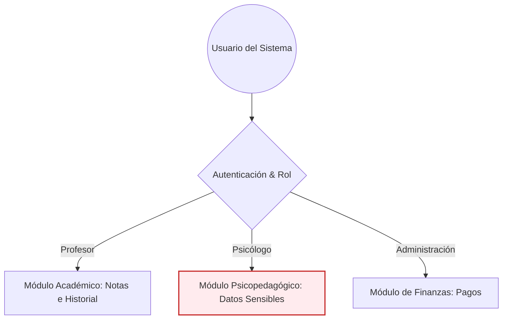

# 🏫 Caso 1: Sistema de Gestión Escolar (K-12)
## Cumplimiento de la Ley N° 21.719 en Educación Básica

Este documento analiza cómo se aplica la nueva normativa chilena de protección de datos personales a un **Sistema de Información Escolar** que gestiona la matrícula, el registro de notas, el historial conductual (antecedentes) y el cobro de mensualidades (pagos).

---

## 📊 1. Mapa de Datos del Sistema

| Módulo del Sistema | Tipos de Datos Tratados | Clasificación Legal | Titular de los Datos |
| :--- | :--- | :--- | :--- |
| **Matrícula y Registro** | Nombres, RUT, fecha de nacimiento, dirección, nivel de escolaridad. | Datos Personales | Estudiante (Niño/Niña) y Apoderado. |
| **Ficha Médica y Psicopedagógica** | Alergias, enfermedades crónicas, diagnósticos psicopedagógicos, informes de psicólogos escolares. | **Datos Sensibles** | Estudiante (Niño/Niña < 14 años). |
| **Académico (Notas y Asistencia)** | Calificaciones, promedios, porcentaje de asistencia, anotaciones de conducta. | Datos Personales | Estudiante. |
| **Financiero y Pagos** | Datos bancarios del apoderado, historial de pago de mensualidades, estado de morosidad. | Datos Personales / Financieros | Apoderado (Adulto). |

---

## ⚖️ 2. Bases Legales de Licitud aplicables al Entorno Escolar

En un colegio, el tratamiento de datos se justifica por diferentes vías según el proceso:

1. **Consentimiento del Apoderado (Obligatorio para menores de 14 años):** 
   * Es la base para actividades no obligatorias por el Ministerio de Educación (Mineduc), como la publicación de fotos en las redes sociales del colegio, el envío de comunicaciones comerciales o el uso de talleres extracurriculares provistos por software de terceros.
2. **Obligación Legal (Mineduc):**
   * El colegio está obligado por ley a registrar la asistencia, las notas y el comportamiento del alumno para certificar su progresión escolar y reportar esta información al Mineduc (SIGE). Para esto **no** se requiere el consentimiento de los padres.
3. **Ejecución de un Contrato:**
   * El cobro de mensualidades y la gestión de la ficha de pago del apoderado se sustentan en el **Contrato de Prestación de Servicios Educacionales** firmado en la matrícula.

---

## 🛑 3. Riesgos Críticos bajo la Ley N° 21.719

> [!CAUTION]
> El tratamiento de datos de niños y niñas menores de 14 años tiene una protección reforzada en la ley. Cualquier infracción que involucre datos de menores o datos sensibles (como la salud o informes psicológicos) se clasifica directamente como **grave o gravísima**.

* **Exposición de Antecedentes Delicados:** Que profesores u otros apoderados accedan a informes psicológicos o anotaciones de conducta confidenciales debido a un control de accesos deficiente.
* **Publicación de Imágenes sin Consentimiento:** Subir fotografías de los alumnos a la página web o redes sociales del establecimiento sin la autorización expresa, escrita y previa del tutor legal.
* **Listados Públicos de Morosidad:** Publicar o exhibir en el colegio listados de apoderados que se encuentren con mensualidades atrasadas (lo cual atenta contra la honra y está penalizado por la ley).
* **Falta de Trazabilidad en Modificaciones:** No registrar mediante logs de auditoría qué usuario del sistema modificó una calificación o eliminó una anotación conductual.

---

## 🛠️ 4. Medidas de Adecuación Técnica y Organizativa

### A. Privacidad desde el Diseño en la Base de Datos
* **Seguridad por Defecto:** Los datos sensibles de salud y las anotaciones psicopedagógicas deben estar cifrados en la base de datos (`at-rest`).
* **Control de Acceso Basado en Roles (RBAC):** 
  * Un profesor de matemáticas solo debe ver las notas de sus asignaturas.
  * El psicólogo del colegio solo debe ver las fichas de los alumnos que atiende.
  * El área de finanzas no debe tener acceso a las notas ni a los diagnósticos médicos de los alumnos.

### B. Gestión del Consentimiento en la Matrícula
* Rediseñar la ficha de matrícula para incorporar **casillas de verificación independientes (opt-in)**. No se permite un único botón para aceptar todo.
  * `[ ]` Autorizo el uso de la imagen de mi hijo/a para fines informativos internos del colegio.
  * `[ ]` Autorizo el uso de la imagen de mi hijo/a en redes sociales y publicidad del colegio.
  * `[ ]` Autorizo el envío de boletines y promociones de talleres extracurriculares.

### C. Derechos de los Apoderados (ARCO-P)
* **Acceso y Rectificación:** Habilitar un portal de apoderados donde puedan visualizar y corregir sus datos de contacto actualizados de forma autónoma.
* **Derecho de Supresión (Cancelación):** Cuando el alumno se retira del establecimiento, el colegio debe conservar los registros académicos exigidos por el Mineduc, pero debe eliminar de forma segura los datos financieros, fotos y accesos a plataformas terceras en un plazo determinado.
