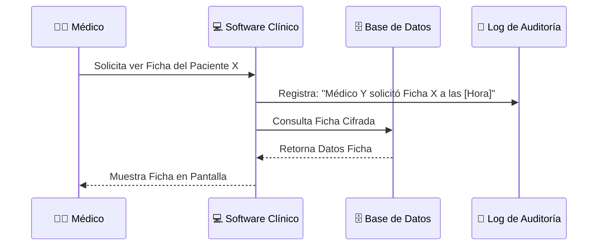

# 🏥 Caso 2: Sistema de Hospital y Laboratorio Clínico
## Cumplimiento de la Ley N° 21.719 en el Sector de la Salud

Este documento analiza la implementación de la nueva normativa chilena en un **Sistema Hospitalario y de Laboratorio Clínico**, el cual procesa consultas médicas, registros de datos personales, historial clínico y resultados de exámenes de laboratorio.

---

## 📊 1. Mapa de Datos del Sistema

| Módulo del Sistema | Tipos de Datos Tratados | Clasificación Legal | Justificación / Sensibilidad |
| :--- | :--- | :--- | :--- |
| **Admisión y Agenda** | RUT, nombres, dirección, teléfono, previsión de salud (Fonasa/Isapre). | Datos Personales | Necesarios para identificar al paciente y facturar la consulta. |
| **Ficha Clínica Electrónica** | Diagnósticos, síntomas, cirugías previas, medicamentos prescritos, antecedentes familiares. | **Datos Sensibles (Salud)** | Su filtración atenta directamente contra la intimidad del titular. |
| **Laboratorio Clínico** | Resultados de análisis de sangre, orina, exámenes genéticos, biopsias. | **Datos Sensibles (Salud / Genéticos)** | Requieren el estándar de seguridad más elevado del sistema. |
| **Historial de Consultas** | Fechas de atención, médicos tratantes, derivaciones de especialistas. | Datos Personales | Revelan patrones de frecuencia médica y áreas de salud tratadas. |

---

## ⚖️ 2. Bases Legales de Licitud aplicables a la Salud

El tratamiento de datos de salud en Chile opera bajo reglas muy estrictas debido a su alta sensibilidad:

1. **Obligación Legal (Ley 20.584 y Código Sanitario):**
   * Los centros de salud están obligados legalmente a llevar una **Ficha Clínica** para garantizar la continuidad del tratamiento y los derechos del paciente. Para esta finalidad, el hospital no requiere solicitar consentimiento para registrar la historia clínica.
2. **Interés Vital del Titular:**
   * En situaciones de emergencia médica (ej. un paciente que ingresa inconsciente a urgencias), el tratamiento de sus datos personales y de salud es lícito de forma inmediata para salvaguardar su vida.
3. **Consentimiento Explícito:**
   * Se requiere obligatoriamente cuando el hospital o laboratorio desea utilizar muestras biológicas o datos de fichas clínicas con fines de **investigación científica**, o bien para enviar campañas preventivas y promociones de servicios médicos no solicitadas.

---

## 🛑 3. Riesgos Críticos bajo la Ley N° 21.719

> [!WARNING]
> Dado que la actividad principal de un hospital es el tratamiento masivo de **datos sensibles (salud y genéticos)**, la ley califica las vulnerabilidades en este sector como críticas. El incumplimiento puede derivar en multas de hasta **20.000 UTM** (o el **4% de los ingresos anuales** de la clínica).

* **Acceso de Personal No Autorizado:** Personal administrativo (cajeros, secretarias) accediendo al contenido de la ficha clínica o diagnósticos de un paciente sin necesidad operativa.
* **Fuga de Información o Ransomware:** El secuestro de fichas clínicas electrónicas o bases de datos de laboratorios mediante malware, inhabilitando el servicio médico y exponiendo datos sensibles a la Dark Web.
* **Errores de Envío en Exámenes:** Remitir resultados de exámenes de laboratorio (ej. tests de VIH o biopsias oncológicas) a correos electrónicos incorrectos por fallas de digitación o validación del sistema.
* **Retención Indefinida sin Criterio:** Conservar registros físicos o digitales más allá de los plazos legales obligatorios de retención de fichas clínicas (habitualmente 15 años en Chile según el reglamento de fichas clínicas).

---

## 🛠️ 4. Medidas de Adecuación Técnica y Organizativa

### A. Trazabilidad Absoluta y Logs de Acceso (Auditoría)
El sistema debe llevar un registro inalterable (log) de cada interacción con la ficha clínica. Se debe registrar obligatoriamente:
* Quién accedió (ID del médico/enfermero).
* Fecha y hora del acceso.
* Qué secciones de la ficha fueron consultadas o modificadas.
* El motivo de la consulta (ej. "Atención de Consulta Programada").

### B. Cifrado de Datos de Salud
* Todos los datos médicos e informes de laboratorio deben ser cifrados tanto **en tránsito** (utilizando protocolos HTTPS/TLS fuertes) como **en reposo** (cifrado de bases de datos AES-256).

### C. El Delegado de Protección de Datos (DPD / DPO)
* **Nombramiento Obligatorio:** Debido al volumen y la naturaleza del tratamiento de datos sensibles, el hospital debe contar con un **DPD** formal ante la Agencia de Protección de Datos Personales (APDP). Su misión será coordinar las Evaluaciones de Impacto (EIPD) periódicas y fiscalizar el cumplimiento de las políticas de ciberseguridad.

### D. Procedimiento de Notificación de Brechas
* En caso de un ataque informático o filtración, el hospital debe contar con un plan de respuesta que le permita notificar a la **APDP** y a los **pacientes afectados** en un plazo máximo (generalmente 72 horas desde que se tiene constancia de la brecha), detallando las medidas de mitigación adoptadas.
