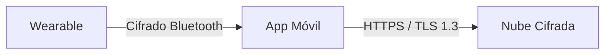

# ⌚ Caso 8: Dispositivos Vestibles e Internet de las Cosas (IoT / Wearables)
## Cumplimiento de la Ley N° 21.719 en Dispositivos de Salud y Smart Home

Este documento detalla la aplicación de la ley chilena en un **Sistema de Internet de las Cosas (IoT) y Wearables** que gestiona un reloj inteligente (smartwatch) recolector de datos biométricos (frecuencia cardíaca, pasos, sueño) y una aplicación móvil conectada a la nube.

---

## 📊 1. Mapa de Datos del Sistema

| Dispositivo / App | Tipos de Datos Tratados | Clasificación Legal | Justificación / Riesgo |
| :--- | :--- | :--- | :--- |
| **Sensores del Wearable** | Frecuencia cardíaca, temperatura corporal, saturación de oxígeno, patrones de sueño. | **Datos Sensibles (Salud)** | Monitoreo del bienestar del usuario. Alto riesgo por ser datos de salud. |
| **Aplicación Móvil** | Edad, peso, estatura, género, nombre de usuario, correo electrónico. | Datos Personales | Calibración de los algoritmos de quema calórica y perfiles de usuario. |
| **Sincronización en Nube** | Historial diario de métricas físicas, geolocalización de rutas deportivas (GPS). | Datos Personales / Salud | Almacenamiento a largo plazo y generación de gráficos de rendimiento. |

---

## ⚖️ 2. Bases Legales de Licitud en IoT y Wearables

* **Consentimiento Explícito e Informado:**
  * Al tratarse de un dispositivo de uso voluntario por el consumidor, la recolección, almacenamiento y análisis de **datos de salud** (frecuencia cardíaca, sueño, etc.) requiere consentimiento explícito. Este debe prestarse al momento de configurar el reloj inteligente por primera vez a través de la aplicación del teléfono.
* **Ejecución de un Contrato:**
  * Para prestar el servicio de sincronización de la cuenta y el respaldo de la información en los servidores, bajo los términos aceptados al comprar el dispositivo.

---

## 🛑 3. Riesgos Críticos bajo la Ley N° 21.719

> [!WARNING]
> Los wearables manejan de manera continua datos sensibles de salud. Las brechas de seguridad que expongan el estado de salud de millones de usuarios o las transferencias sin control internacional son consideradas faltas gravísimas por la APDP.

* **Transferencia Internacional Irregular:** Sincronizar los datos de salud del usuario con servidores en el extranjero (por ejemplo, en servidores de nube en EE.UU., Europa o Asia) sin contar con contratos de transferencia que incluyan Cláusulas Contractuales Tipo (CCT) o sin verificar que el proveedor cumpla estándares equivalentes a la ley chilena.
* **Falta de Seguridad en el Dispositivo Físico:** Que el reloj inteligente transmita los datos biométricos al celular vía Bluetooth sin encriptar, permitiendo que un tercero cercano intercepte los latidos o la ubicación del usuario.
* **Uso de Datos de Salud para Perfilamiento Comercial:** Compartir el historial de frecuencia cardíaca o peso con compañías de seguros de salud o clínicas privadas sin el consentimiento explícito de los usuarios (lo cual está expresamente prohibido por ley).

---

## 🛠️ 4. Medidas de Adecuación Técnica y Organizativa

### A. Cifrado Extremo de Datos Biométricos
* **Cifrado en Tránsito (Bluetooth & HTTPS):** Toda la comunicación local mediante Bluetooth Low Energy (BLE) entre el wearable y el celular debe estar cifrada. La subida de datos desde el celular a la nube debe utilizar TLS 1.3.
* **Cifrado en Reposo en la Nube:** Los registros históricos de salud de los usuarios deben guardarse cifrados en las bases de datos de la nube.

### B. Gestión del Consentimiento en la App
* Durante el flujo de configuración (*onboarding*), separar los consentimientos de forma granular:
  * `[ ]` Acepto crear mi cuenta para sincronizar mis datos. (Necesario para el servicio)
  * `[ ]` Autorizo el tratamiento de mis datos de salud (frecuencia cardíaca, sueño) recopilados por el dispositivo. (Obligatorio para que los sensores guarden datos)
  * `[ ]` Autorizo compartir mis datos deportivos anonimizados para estudios científicos agregados. (Opcional)

### C. Adecuación de Transferencias Internacionales (Nube)
* Dado que la infraestructura de backend de estos sistemas suele utilizar nubes globales (ej. AWS, Azure, Google Cloud):
  * Suscribir los **Data Processing Addendums (DPA)** provistos por los proveedores de nube, los cuales deben incorporar cláusulas contractuales estandarizadas alineadas con el RGPD y validadas por la Agencia de Protección de Datos de Chile.
  * Mantener un registro actualizado del país y el data center exacto donde se almacenan físicamente los datos de los usuarios chilenos.
