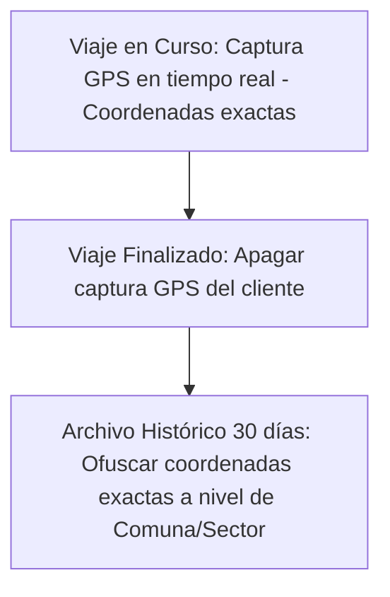

# 🚗 Caso 7: Aplicaciones de Transporte de Pasajeros y Delivery
## Cumplimiento de la Ley N° 21.719 en Movilidad y Logística On-Demand

Este documento describe la adecuación legal de un **Sistema de Transporte o Delivery** que opera mediante aplicaciones móviles, gestionando geolocalización en tiempo real, perfiles de conductores/repartidores, hábitos de consumo e historial de viajes.

---

## 📊 1. Mapa de Datos del Sistema

| Módulo del Sistema | Tipos de Datos Tratados | Clasificación Legal | Finalidad del Tratamiento |
| :--- | :--- | :--- | :--- |
| **Geolocalización GPS** | Ubicación exacta en tiempo real del usuario y del conductor/repartidor. | Datos Personales | Coordinación del viaje o la entrega del pedido. |
| **Historial de Viajes / Rutas** | Coordenadas de inicio, ruta trazada, hora de viaje y destino. | Datos Personales | Liquidación del cobro, seguridad física del viaje e historial del usuario. |
| **Perfil del Conductor** | Nombre, RUT, licencia de conducir, certificado de antecedentes penales. | Datos Personales / Sensibles | Habilitación legal para conducir y seguridad del pasajero. |
| **Hábitos de Consumo** | Locales preferidos, tipo de comida comprada, frecuencia y horarios. | Datos de Comportamiento | Optimización de la oferta comercial y publicidad en la app. |

---

## ⚖️ 2. Bases Legales de Licitud en Apps de Movilidad

* **Ejecución de un Contrato:**
  * Es la base legal que permite conectar al usuario con el conductor o repartidor más cercano, procesar el pago del servicio mediante la tarifa calculada y trazar la ruta de viaje.
* **Consentimiento Expreso (Granular y Revocable):**
  * **Geolocalización en Segundo Plano:** El rastreo de la ubicación del usuario cuando la app no está en uso activo requiere consentimiento expreso, con justificaciones muy claras de seguridad o funcionalidad.
  * **Anuncios Basados en Comportamiento:** Si la app de delivery sugiere restaurantes o marcas asociadas mediante el perfilamiento de hábitos de compra históricos.
* **Obligación Legal:**
  * La llamada "Ley Uber" (Ley 21.553) en Chile exige registrar antecedentes de los conductores y vehículos en un registro oficial del Ministerio de Transportes.

---

## 🛑 3. Riesgos Críticos bajo la Ley N° 21.719

> [!CAUTION]
> La geolocalización constante permite deducir información altamente sensible de las personas (como visitas frecuentes a centros de salud, templos religiosos o sedes de partidos políticos). El mal uso de esta información acarrea graves sanciones.

* **Rastreo Innecesario o Silencioso:** Continuar recolectando la geolocalización GPS del teléfono del usuario una vez que el viaje o la entrega ha concluido de forma definitiva.
* **Fuga de Antecedentes de Conductores:** La filtración de los certificados de antecedentes penales de los conductores (considerados datos sensibles/protegidos).
* **Decisiones Algorítmicas de Bloqueo:** Suspender o bloquear la cuenta de un conductor o repartidor de forma 100% automatizada (por ejemplo, basándose en la tasa de rechazo de viajes o evaluaciones) sin informarle claramente del motivo ni otorgar un canal humano para apelar la suspensión.

---

## 🛠️ 4. Medidas de Adecuación Técnica y Organizativa

### A. Control de Geolocalización y Minimización de Datos
* **Políticas de Captura:** La app móvil debe apagar estrictamente el rastreo GPS en el dispositivo del cliente tan pronto como el estado del viaje o pedido cambie a "Finalizado".
* **Ofuscación de Direcciones Históricas:** En el historial de viajes visible para el área de soporte, las direcciones exactas de inicio y fin deben ofuscarse o generalizarse (ej. mostrar solo la comuna o intersección aproximada) transcurrido un tiempo de archivo.

### B. Transparencia en Bloqueos y Perfiles
* Diseñar un **Procedimiento de Revisión Humana de Bloqueos** para conductores y usuarios. Si el algoritmo de fraude gatilla un bloqueo, se debe notificar inmediatamente explicando las causas (ej. "Múltiples cancelaciones sospechosas") y dar un plazo para apelar ante un agente humano de soporte.

### C. Almacenamiento Seguro de Documentos de Conductores
* Los documentos de acreditación (licencia de conducir, RUT, antecedentes) deben guardarse en un repositorio de archivos en la nube con acceso restringido bajo el principio de "mínimo privilegio" y con cifrado AES-256. El personal de soporte general solo debe ver un indicador de "Documento Validado: Sí/No".
* Implementar destrucción automática de documentos si el postulante a conductor es rechazado permanentemente.
