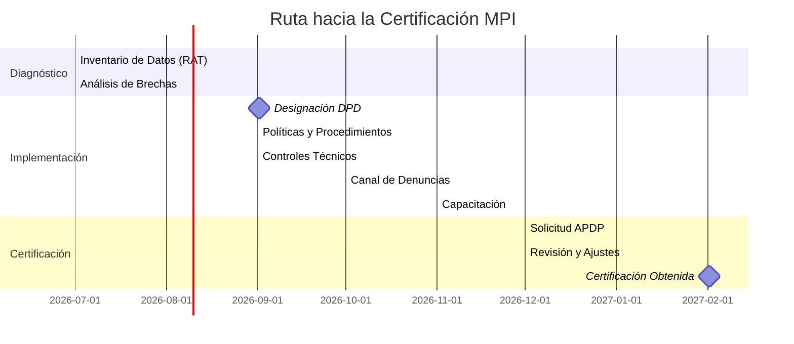

# GUÍA DE CERTIFICACIÓN MPI ANTE LA APDP
## Modelo de Prevención de Infracciones - Ley 21.719

Esta guía explica el proceso completo para obtener la **certificación del Modelo de Prevención de Infracciones (MPI)** ante la Agencia de Protección de Datos Personales (APDP), según lo dispuesto en el **Artículo 49 de la Ley 21.719** y el **Decreto Supremo N° 662/2025**.

---

## Resumen Ejecutivo

| Aspecto | Detalle |
|---------|---------|
| **¿Qué es?** | Programa de compliance voluntario que demuestra que la organización ha implementado medidas para prevenir infracciones de protección de datos. |
| **¿Es obligatorio?** | No, pero la certificación funciona como **atenuante muy calificada** ante sanciones. |
| **¿Quién certifica?** | **Exclusivamente la APDP** (Agencia de Protección de Datos Personales). No existen empresas privadas certificadoras. |
| **Vigencia** | 3 años, renovable previa revisión. |
| **Registro** | Se inscribe en el Registro Nacional de Sanciones y Cumplimiento (público). |
| **Base legal** | Arts. 49-51 Ley 21.719 + DS 662/2025. |

---

## Los 7 Elementos del MPI

Según el Art. 49 de la Ley 21.719, el MPI debe contener:

### 1. Designación del DPD
- Nombrar formalmente un Delegado de Protección de Datos
- Definir sus medios, facultades, presupuesto y autonomía
- Publicar su contacto: `dpo@empresa.cl`
- Puede ser interno o externo (persona natural o jurídica)

### 2. Identificación de la Información Tratada
- **RAT (Registro de Actividades de Tratamiento):** Documentar cada base de datos o tratamiento
- Para cada tratamiento: tipo de datos, base legal, finalidad, plazo de conservación, destinatarios
- Mapa de flujo de datos dentro y fuera de la organización

### 3. Matriz de Riesgos
Identificar las actividades de tratamiento con mayor probabilidad de infracción:

| Tratamiento | Riesgo | Probabilidad | Impacto | Controles | Riesgo Residual |
|-------------|--------|-------------|---------|-----------|-----------------|
| Datos de salud | Filtración | Media | Crítico | Cifrado AES-256 + RBAC | Bajo |
| Marketing | Spam sin consentimiento | Alta | Alto | Consent Manager + doble opt-in | Medio |
| Geolocalización | Rastreo excesivo | Media | Alto | Política de minimización + límites técnicos | Bajo |

### 4. Protocolos y Procedimientos Internos
- Políticas de privacidad desde el diseño
- Procedimientos para ejercicio de derechos ARCO-P
- Protocolo de notificación de brechas (máx. 72 horas APDP)
- Procedimiento de evaluación de impacto (EIPD/DPIA)

### 5. Canal de Denuncia Interna
- Sistema anónimo y confidencial para reportar infracciones
- Debe estar disponible para empleados y terceros
- Incluir protección contra represalias para denunciantes

### 6. Capacitación Continua
- Programas de formación anual para todos los empleados que traten datos
- Capacitación específica para equipos de tecnología y legales
- Registro de asistencia y evaluaciones de conocimiento

### 7. Supervisión y Mejora Continua
- Auditorías internas periódicas (al menos anuales)
- Revisión y actualización del MPI
- Reporte anual al Directorio o Gerencia sobre estado del cumplimiento

---

## Paso a Paso para la Certificación

### Fase 1: Diagnóstico (2-3 meses)
1. Realizar inventario completo de datos (RAT)
2. Identificar brechas (Gap Analysis contra la Ley 21.719)
3. Evaluar criticidad de los tratamientos
4. Determinar si el MPI es necesario (voluntario)

### Fase 2: Diseño e Implementación (3-6 meses)
1. Designar al DPD
2. Documentar políticas y procedimientos
3. Implementar controles técnicos (cifrado, RBAC, logs)
4. Habilitar canal de denuncias
5. Capacitar al personal
6. Realizar EIPD para tratamientos de alto riesgo

### Fase 3: Certificación (1-3 meses)
1. Completar el formulario de solicitud de certificación APDP
2. Adjuntar la documentación del MPI:
   - RAT completo
   - Matriz de riesgos
   - Políticas y procedimientos
   - Acreditación del DPD
   - Programa de capacitaciones
   - Canal de denuncias
3. Someter a revisión de la APDP
4. Responder observaciones (si las hay)
5. Recibir certificación (vigencia: 3 años)

### Fase 4: Mantención (permanente)
- Actualizar RAT semestralmente
- Repetir capacitaciones anualmente
- Realizar auditorías internas anuales
- Reportar cambios relevantes a la APDP
- Solicitar renovación antes del vencimiento

---

## Checker de Documentos para la Solicitud

| Documento | Requerido | Formato |
|-----------|-----------|---------|
| RAT (Registro de Actividades de Tratamiento) | Obligatorio | Excel, CSV o sistema digital |
| Matriz de Riesgos | Obligatorio | Tabla o software |
| Acta de Nombramiento DPD | Obligatorio | PDF firmado |
| Política de Privacidad actualizada | Obligatorio | PDF |
| Procedimiento ARCO-P | Obligatorio | PDF |
| Protocolo de Notificación de Brechas | Obligatorio | PDF |
| EIPD (tratamientos alto riesgo) | Segn aplique | PDF |
| Contratos de Encargados de Tratamiento (DPAs) | Segn aplique | PDF firmados |
| Programa de Capacitación | Obligatorio | PDF + registros |
| Canal de Denuncia | Obligatorio | Captura o URL |

---

## Timeline Recomendado

