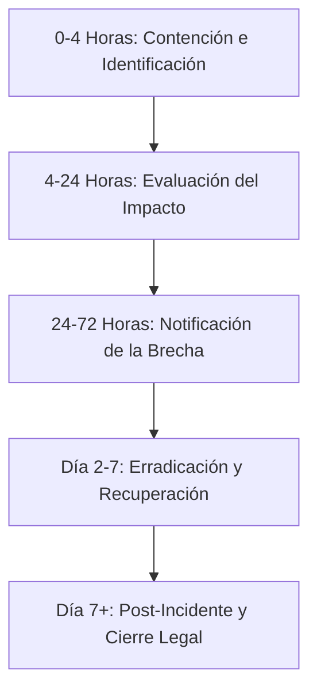

# Guía Práctica de Respuesta y Reporte de Incidentes de Ciberseguridad en Chile
### Cumplimiento ante la Ley N° 21.719 (Protección de Datos) y Ley N° 21.663 (Ley Marco de Ciberseguridad)

Esta guía establece el protocolo de actuación paso a paso que una organización en Chile debe seguir al detectar una brecha de seguridad o incidente cibernético (ej. ransomware, filtración de datos, accesos no autorizados), detallando las entidades a notificar, los datos de contacto clave y la documentación obligatoria que se debe mantener.

---

## 1. Protocolo de Respuesta Paso a Paso (Incident Response Plan)

Ante la sospecha o confirmación de un incidente de seguridad, se debe actuar según la siguiente línea de tiempo crítica:

### Paso 1: Detección e Identificación (Horas 0 - 4)
* **Aislar los sistemas afectados:** Desconectar los servidores, estaciones de trabajo o bases de datos de la red (internet y red local corporativa) para detener la propagación del malware o el acceso del intruso. **No apague los equipos de inmediato**, ya que podría borrar evidencia volátil en la memoria RAM.
* **Activar el Comité de Crisis:** Reunir al responsable técnico (TI/Ciberseguridad), al Delegado de Protección de Datos (DPD), asesores legales y gerencia general.
* **Iniciar Bitácora Técnica:** Registrar cada acción tomada, hora exacta, personas involucradas y hallazgos iniciales. Esta bitácora servirá de prueba ante futuras fiscalizaciones.

### Paso 2: Evaluación del Impacto (Horas 4 - 24)
* **Determinar datos comprometidos:** Identificar si la brecha afectó a:
  * Datos Personales Generales (nombres, RUT, contacto).
  * Datos Sensibles (salud, menores de edad, datos biométricos, orientación sexual).
  * Datos Financieros (tarjetas de crédito, datos bancarios).
* **Medir el volumen de afectados:** Estimar el número de titulares de datos (clientes, empleados, usuarios) afectados.
* **Analizar la causa raíz:** Identificar el vector de entrada (ej. phishing, vulnerabilidad VPN, credenciales débiles).

### Paso 3: Notificación y Reportes Oficiales (Horas 24 - 72)
* **Notificación a la APDP (Obligatorio bajo Ley 21.719):** Si se confirma una filtración o alteración de datos personales, la empresa tiene un plazo máximo e improrrogable de **72 horas** desde que tenga conocimiento de la brecha para reportar formalmente el incidente a la **Agencia de Protección de Datos Personales (APDP)**.
* **Notificación a los Afectados (Titulares):** Si la brecha representa un riesgo alto para los derechos y libertades de las personas (ej. robo de credenciales, datos de salud o financieros), se les debe comunicar de inmediato y de forma clara, indicando qué datos se filtraron y qué acciones deben tomar (como cambiar contraseñas).
* **Notificación al CSIRT / ANCI (Obligatorio para Operadores de Servicios Esenciales):** Si la empresa pertenece a sectores estratégicos o infraestructura crítica, debe reportar el incidente a la Agencia Nacional de Ciberseguridad (ANCI) en el menor tiempo posible.

### Paso 4: Denuncia ante las Policías (Horas 24 - 48)
* Si el incidente involucra sabotaje informático, acceso ilícito o extorsión (como ransomware), constituye un delito bajo la **Ley 21.459 de Delitos Informáticos**. Se debe interponer la denuncia penal en la Brigada del Cibercrimen de la PDI o ante la Fiscalía.

### Paso 5: Erradicación y Recuperación (Días 2 - 7)
* **Limpieza de sistemas:** Eliminar el malware, revocar credenciales comprometidas y parchar las vulnerabilidades explotadas.
* **Restauración segura:** Levantar los servicios utilizando respaldos inmutables u *offline* previamente verificados.
* **Monitoreo:** Implementar reglas de auditoría adicionales para asegurar que el atacante no mantenga persistencia en la red.

### Paso 6: Post-Incidente (Día 7 en adelante)
* **Informe Post-Mortem:** Elaborar un informe final que detalle las fallas, las soluciones y las medidas preventivas para que no vuelva a ocurrir.
* **Actualización del MPI:** Ajustar el Modelo de Prevención de Infracciones de la empresa según las lecciones aprendidas.

---

## 2. Directorio de Contactos de Emergencia en Chile

Guarde y mantenga actualizados los siguientes contactos de los organismos reguladores y policiales chilenos:

### A. Agencia Nacional de Ciberseguridad (ANCI) - CSIRT Nacional
* **Propósito:** Reportar incidentes de ciberseguridad, ataques de denegación de servicio (DDoS), ransomware e intrusiones técnicas para recibir apoyo en mitigación.
* **Teléfono de Emergencia (24/7):** **1510** *(Corto, gratuito y confidencial)*
* **Teléfono Alternativo:** **+56 44 771 1131**
* **Correo Electrónico de Apoyo:** `ayuda@anci.gob.cl`
* **Sitio Web Oficial:** [csirt.gob.cl](https://csirt.gob.cl) / [anci.gob.cl](https://www.anci.gob.cl)

### B. PDI — Brigada Investigadora del Cibercrimen
* **Propósito:** Realizar la denuncia penal por delitos informáticos (extorsión, acceso no autorizado, daño informático).
* **Teléfono General de Emergencias PDI:** **134**
* **Brigada Cibercrimen Metropolitana (Santiago):**
  * **Teléfonos:** `+56 2 2708 0658` / `+56 2 2708 0659`
  * **Correo Electrónico:** `guardia@cibercrimen.cl`
  * **Dirección:** General Mackenna 1370, Santiago Centro.
* **Brigada Cibercrimen Valparaíso:**
  * **Teléfono:** `+56 32 331 1500`
  * **Correo Electrónico:** `cibercrimen.vpo@investigaciones.cl`
  * **Dirección:** Uruguay 174, Valparaíso.
* **Brigada Cibercrimen Concepción:**
  * **Teléfono:** `+56 41 286 5129`
  * **Correo Electrónico:** `cibercrimen.coc@investigaciones.cl`
  * **Dirección:** Angol 861, Concepción.

### C. Agencia de Protección de Datos Personales (APDP)
* **Propósito:** Notificar brechas de datos de carácter personal y sensible dentro de las 72 horas exigidas por la Ley N° 21.719.
* **Canal Oficial:** Formulario de Reporte de Brechas de Seguridad en el portal de la APDP (enlace oficial habilitado en su portal institucional).

### D. SERNAC (Servicio Nacional del Consumidor)
* **Propósito:** Informar proactivamente (autodenuncia) si el incidente afecta datos de consumidores que puedan vulnerar la Ley de Protección al Consumidor.
* **Sitio Web:** [sernac.cl](https://www.sernac.cl) *(Sección Portal Proveedores / Oficios y Alertas)*

### E. CMF (Comisión para el Mercado Financiero) — *Solo Sector Financiero*
* **Propósito:** Reportar de forma inmediata incidentes operacionales y ciberataques en bancos, aseguradoras y fintechs reguladas.
* **Canal:** Plataforma SEIL (Sistema de Envío de Información de Incidentes) / Correo `incidentes@cmfchile.cl`

---

## 3. Documentación Requerida (¿Qué tener preparado y qué recopilar?)

Ante una auditoría de la APDP o una investigación policial, la empresa debe demostrar diligencia activa presentando la siguiente carpeta de documentación:

### Documentación Preventiva (Tener preparada de antemano)
1. **RAT / RoPA (Registro de Actividades de Tratamiento):** Inventario de todas las bases de datos de la empresa, detallando qué datos recopilan, dónde se almacenan, quién tiene acceso y su plazo de retención.
2. **Plan de Respuesta a Incidentes (IRP):** Documento formal firmado por el directorio que describa roles y el protocolo de contención.
3. **Contratos DPA (Data Processing Agreement):** Acuerdos firmados con los proveedores de hosting o nube (ej. AWS, Azure, proveedores locales) donde se delimiten las responsabilidades de seguridad del encargado.
4. **Historial de Capacitaciones de Seguridad:** Evidencia de que los empleados reciben formación anual en phishing y seguridad digital.

### Evidencia del Incidente (A recolectar y documentar durante la crisis)
1. **Bitácora Cronológica del Incidente:** Bitácora en texto plano u hoja de cálculo con la fecha, hora exacta y descripción de cada acción realizada durante la contención y mitigación.
2. **Logs Técnicos de Sistema:** Copias seguras de los logs del firewall, servidores DNS, Active Directory y base de datos correspondientes a las fechas del ataque.
3. **Muestra / Nota de Rescate:** Capturas de pantalla o copia del archivo de texto generado por el ransomware (ej. nota de rescate) o los correos de extorsión de los atacantes.
4. **Copia del Formulario de Notificación APDP:** Respaldar el documento o comprobante digital del reporte de 72 horas enviado a la Agencia.
5. **Comprobante de Denuncia Policial:** Copia de la denuncia efectuada ante la Fiscalía o la PDI (copia del parte de denuncia con el RUC/Número de causa).
6. **Comunicaciones Enviadas a los Titulares:** Copias de los correos electrónicos, cartas o notificaciones web dirigidas a los pacientes/clientes afectados alertando sobre la brecha.
